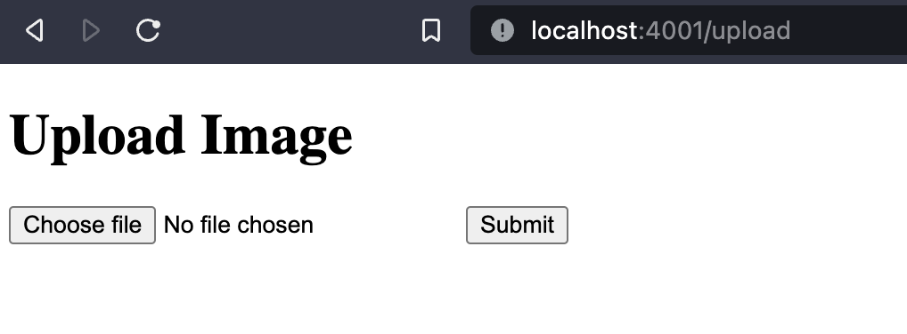

# My Project

This is a backend project which allows user to upload their images and files to my local database .
ive done this using node.js,multer(middleware),and ejs (instead of ejs you can use html  ,well and good)

## Screenshot

Here's a screenshot of the project:

